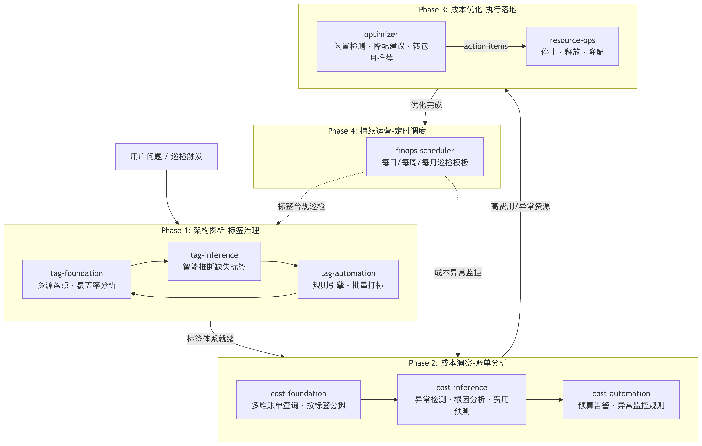
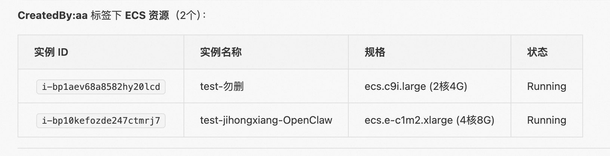
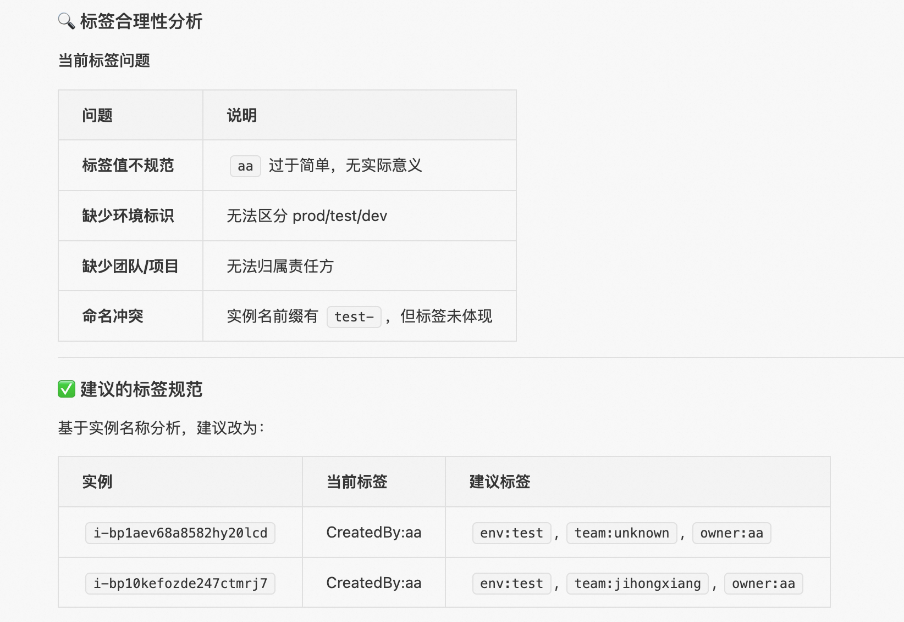
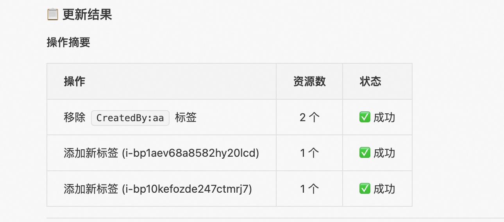
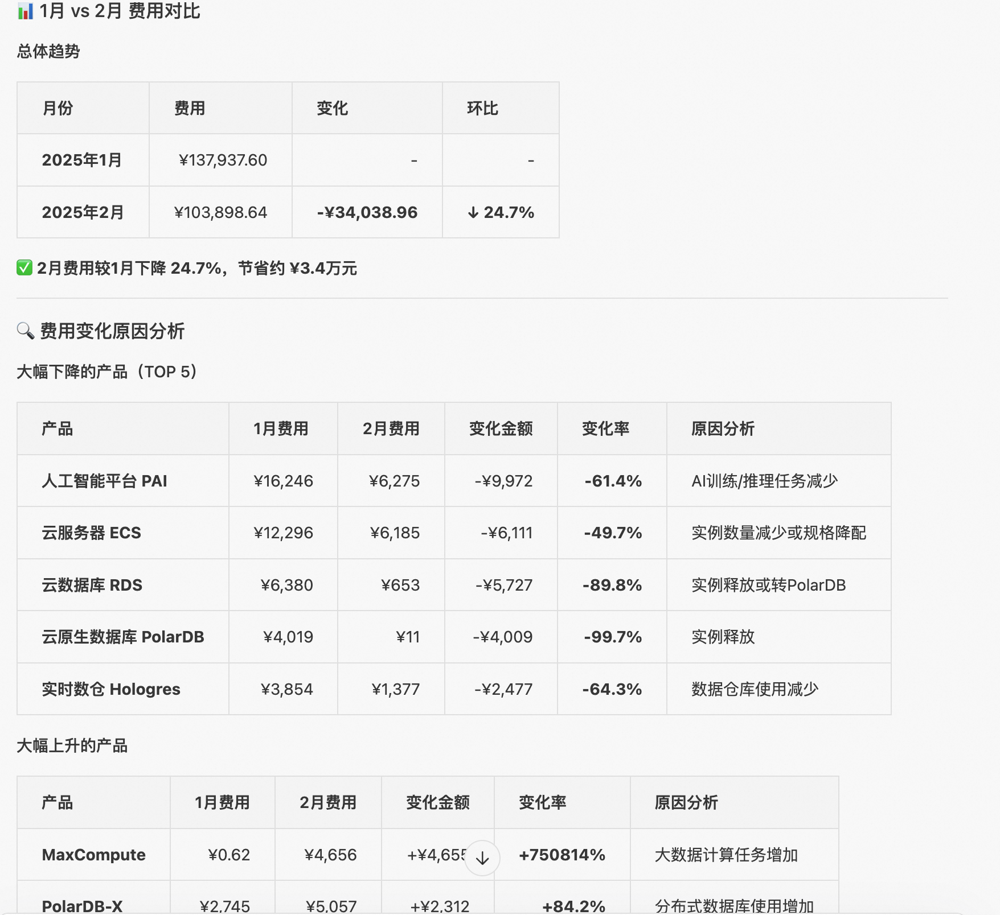
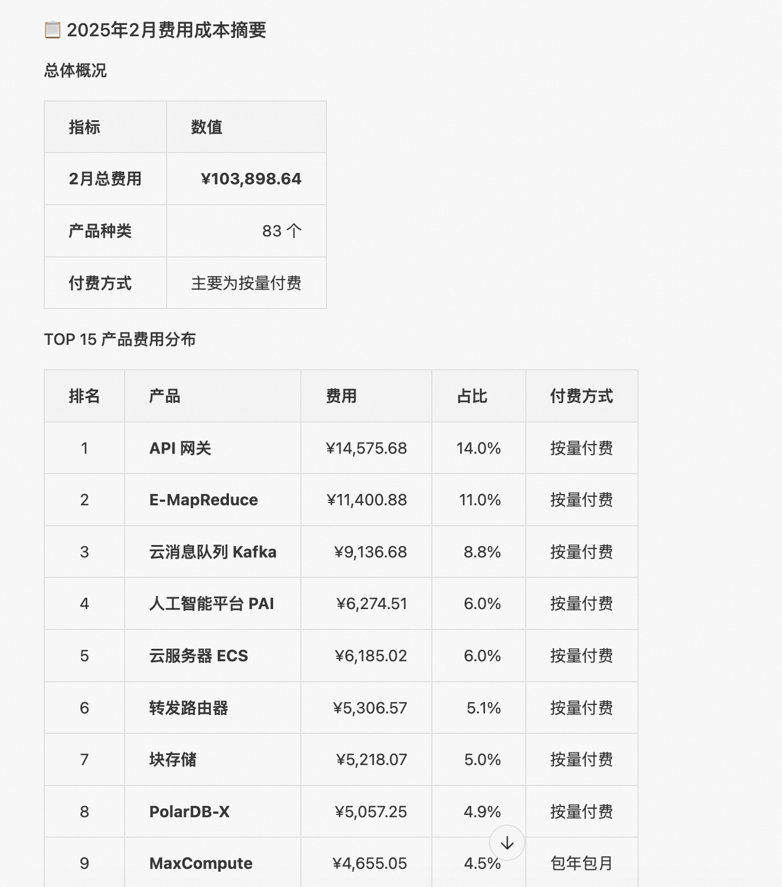
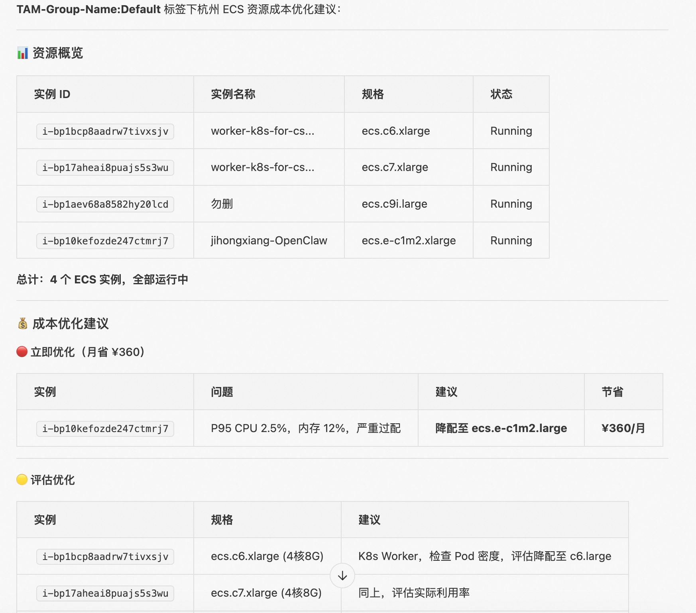
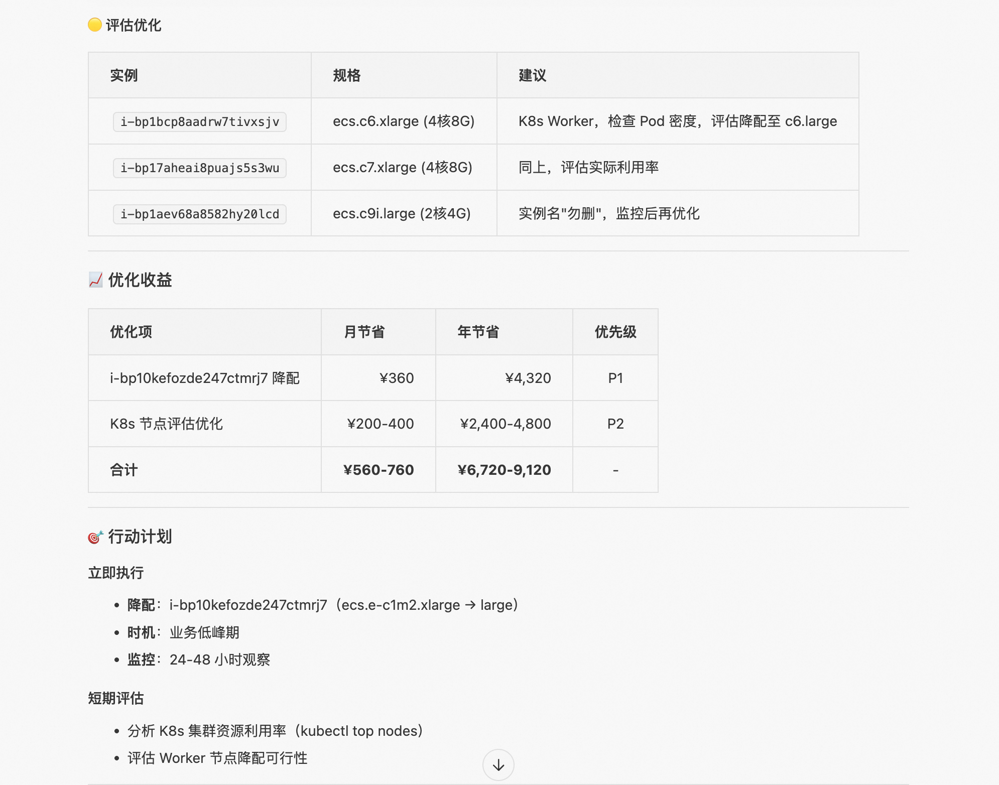
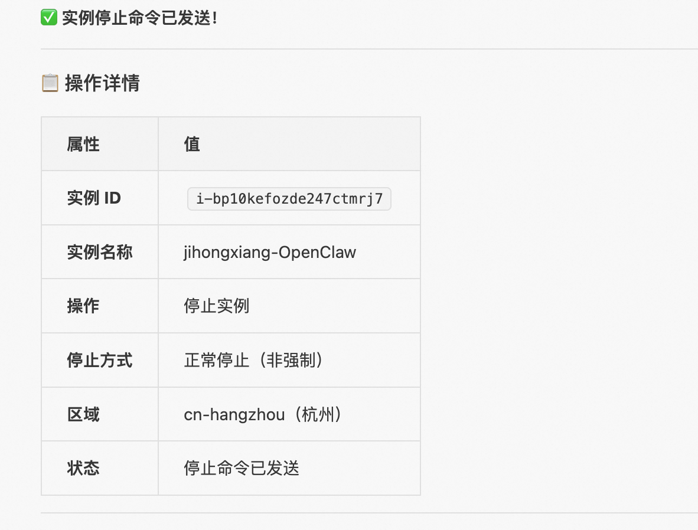
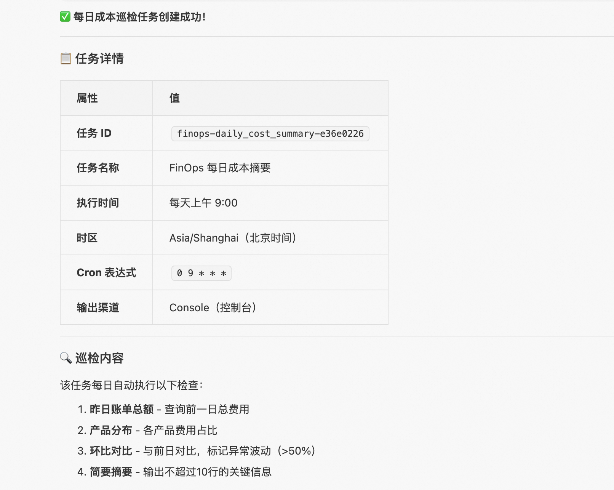

# Aliyun FinOps Skills

阿里云 FinOps 技能集 — 成本分析、标签治理、资源优化、运维调度。

## 技能列表

### 成本分析（Cost）

| 技能 | 层级 | 说明 |
|------|------|------|
| [aliyun-cost-foundation](./aliyun-cost-foundation/) | Foundation | 账单查询、趋势分析、价格查询、成本分摊 |
| [aliyun-cost-automation](./aliyun-cost-automation/) | Automation | 预算告警、异常检测规则 |
| [aliyun-cost-inference](./aliyun-cost-inference/) | Inference | 异常根因分析、费用预测、SP/RI 购买推荐 |

### 标签治理（Tag）

| 技能 | 层级 | 说明 |
|------|------|------|
| [aliyun-tag-foundation](./aliyun-tag-foundation/) | Foundation | 资源发现、覆盖率分析、合规检查、批量打标 |
| [aliyun-tag-automation](./aliyun-tag-automation/) | Automation | 基于规则自动推断和传播标签 |
| [aliyun-tag-inference](./aliyun-tag-inference/) | Inference | 基于启发式规则和拓扑分析智能推断标签 |

### 资源优化（Optimizer）

| 技能 | 说明 |
|------|------|
| [aliyun-optimizer](./aliyun-optimizer/) | 多产品成本优化分析（ECS/RDS/EBS/EIP/SLB/CDN 等），闲置检测、降配建议、转包月推荐 |

### 运维与调度

| 技能 | 说明 |
|------|------|
| [aliyun-resource-ops](./aliyun-resource-ops/) | 资源生命周期管理（启动/停止/重启/释放） |
| [aliyun-finops-scheduler](./aliyun-finops-scheduler/) | 定时巡检任务（每日成本摘要、每周全面巡检等） |

## 架构概览



## 快速开始

### 1. 安装依赖

```bash
pip install alibabacloud-tea-openapi \
    alibabacloud-ecs20140526 \
    alibabacloud-rds20140815 \
    alibabacloud-bssopenapi20171214 \
    alibabacloud-tag20180828 \
    alibabacloud-cms20190101 \
    alibabacloud-slb20140515 \
    alibabacloud-vpc20160428 \
    alibabacloud-r-kvstore20150101 \
    alibabacloud-dds20151201 \
    alibabacloud-nas20170626 \
    alibabacloud-resourcecenter20221201
```

### 2. 配置凭证

设置环境变量：

```bash
export ALIBABA_CLOUD_ACCESS_KEY_ID=your_access_key_id
export ALIBABA_CLOUD_ACCESS_KEY_SECRET=your_access_key_secret
```

### 3. 使用示例

```
# 查账单
"帮我查一下上个月的账单"

# 成本趋势
"最近 6 个月的费用趋势是怎样的"

# 闲置检测
"帮我检测一下闲置资源"

# 标签覆盖率
"看一下标签覆盖率"
```

## 目录结构

每个 skill 遵循以下结构：

```
skill-name/
├── SKILL.md           # 技能说明文件（必需）
├── scripts/           # 脚本目录
│   └── tools.py       # 工具函数
└── references/        # 参考文档目录
    └── .gitkeep
```

## 数据源说明

| 场景 | 数据源 | 说明 |
|------|--------|------|
| 账单查询 | BSS 账单 API | 历史已发生费用，T+1 延迟 |
| 价格查询 | 询价 API | 实时查询规格价格，支持模拟配置变更 |
| 资源利用率 | 云监控 CMS | 7 天监控数据，P95 统计 |
| 资源列表 | 资源中心 | 跨产品跨区域统一查询 |

## 权限要求

| 技能 | 所需 RAM 权限 |
|------|--------------|
| cost-* | `AliyunBSSReadOnlyAccess` |
| tag-* | `resourcecenter:SearchResources`, `tag:TagResources` |
| optimizer | `AliyunECSReadOnlyAccess`, `AliyunRDSReadOnlyAccess`, `AliyunCMSReadOnlyAccess` 等 |
| resource-ops | 对应产品的读写权限 |

## 效果展示

### 示例 1：标签治理

**问题**：简要给出 CreatedBy:aa 这个标签下的 ECS 资源信息，并判断标签是否合理，如不合理需要帮我合理打标

**触发技能**：aliyun-tag-foundation + aliyun-tag-automation + aliyun-tag-inference







---

### 示例 2：成本分析

**问题**：从账单上帮我分析2月费用和1月比是增长了还是下降了，帮我分析一下简要原因，并给我一个2月的费用成本摘要

**触发技能**：aliyun-cost-foundation + aliyun-cost-inference + aliyun-cost-automation





---

### 示例 3：资源优化

**问题**：对 TAM-Group-Name:Default 这个标签下杭州的 ECS 资源给出一个简要的成本优化建议

**触发技能**：aliyun-optimizer





---

### 示例 4：资源运维

**问题**：帮我停止这台 ECS 实例

**触发技能**：aliyun-resource-ops



---

### 示例 5：定时巡检

**问题**：帮我创建一个每日成本巡检任务

**触发技能**：aliyun-finops-scheduler


